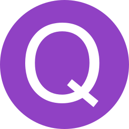

 

  

  <h3 align="center">OpenQuizz</h3>

  

    Программа для запоминания терминов. 
     
     
  

## О проекте

Разработано в рамках конференции "Марс - ИТ". 

## Созданно с помощью

Написано на языке Python, с применением фреймворка flet
